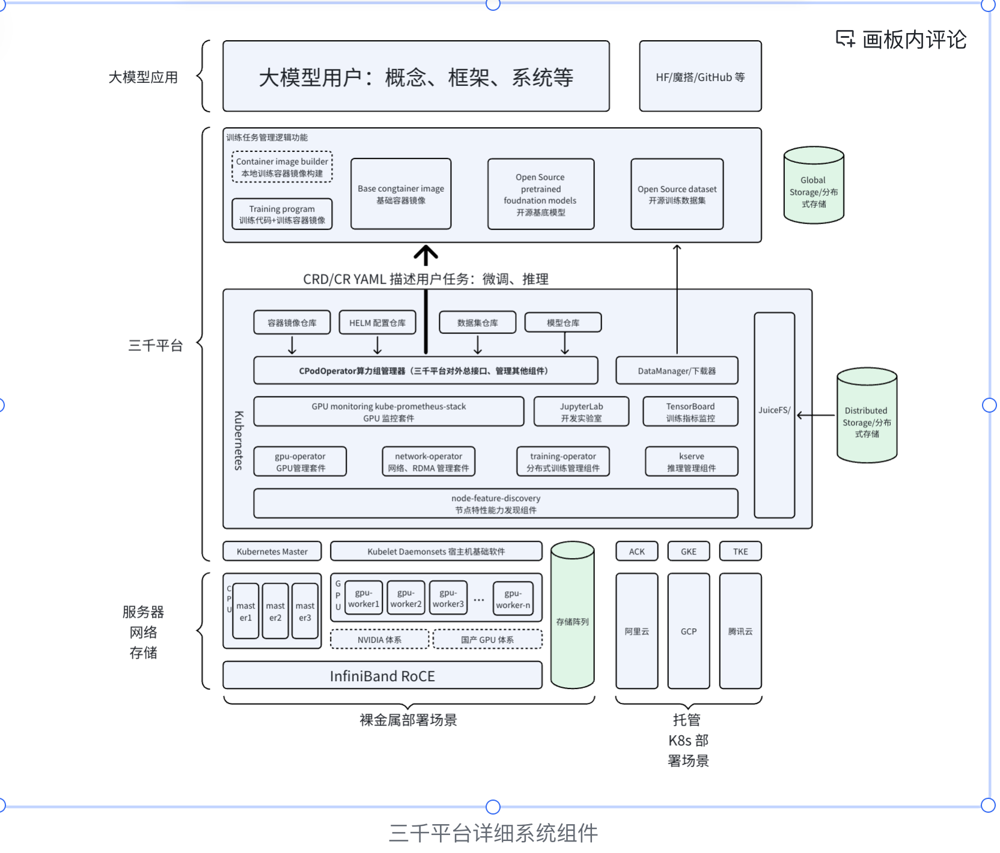
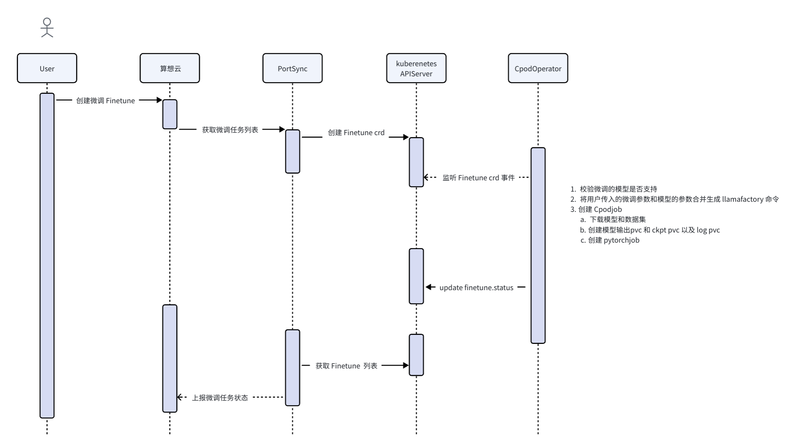

# 项目系统架构

本文档描述本项目的整体系统架构，包括核心组件、数据流与外部依赖。



## 一、架构概览

本项目（3k / cpodoperator）是一套 **Kubernetes 原生的大模型训练与推理平台**，主要包含：

1. **Kubernetes Operator（cpodoperator）**：在集群内监听 CRD，驱动训练、推理、存储等资源的创建与调和。
2. **Portal 同步服务（portalsynch）**：与算想云 Portal 对接，将云端下发的任务同步到集群，并上报集群状态与资源信息。
3. **自定义资源（CRD）与控制器**：对模型/数据集、训练任务、推理服务、开发环境等进行抽象与自动化管理。

用户可通过 **算想云控制台** 或直接操作 Kubernetes 资源使用该平台。

---

## 二、核心进程与部署形态

### 2.1 Operator 进程（`cmd/operator`）

- **入口**：`cpodoperator/cmd/operator/main.go`
- **职责**：运行 controller-runtime Manager，注册所有 CRD 与 Reconciler，对集群内 CR 进行调和。
- **能力**：指标（`:8080`）、健康检查（`:8081`）、可选 Leader 选举（ID: `2ca7307e.cpod`）。
- **依赖 Scheme**：cpod v1beta1、cpod v1、Kubeflow Training Operator（PyTorchJob、MPI 等）、KServe、Ray（KubeRay）。

### 2.2 Portal 同步进程（`cmd/portalsynch`）

- **入口**：`cpodoperator/cmd/portalsynch/main.go`
- **职责**：与算想云 Portal（API_ADDRESS、ACCESS_KEY、CPOD_ID，通常由 cairong 通过 ConfigMap 提供）交互。
- **依赖**：名为 `cpod-info` 的 ConfigMap（见 `cpodoperator/cmd/portalsynch/README.md`）。

同步器内部由 **synchronizer.Manager** 统一调度以下可运行组件（按周期执行）：

| 组件             | 说明                                                                                                                                                             |
| ---------------- | ---------------------------------------------------------------------------------------------------------------------------------------------------------------- |
| **SyncJob**      | 从 Portal 拉取「训练 / 推理 / JupyterLab / YAML 应用」任务，在集群中创建对应 CR（CPodJob、Inference、JupyterLab、YAMLResource）；可选将训练产出模型回传 Portal。 |
| **Uploader**     | 将 CPodObserver 写入 channel 的心跳数据上传到 Portal（HeartBeat）。                                                                                              |
| **CPodObserver** | 采集集群内训练任务、FineTune、推理服务、JupyterLab、YAML 应用状态，组装为心跳 payload 写入 channel。                                                             |
| **Playground**   | 与 LiteLLM 等 Playground 服务对接（如注册模型、同步推理地址等）。                                                                                                |

---

## 三、CRD 与控制器

### 3.1 已注册的控制器（Operator 内）

| 控制器                     | 主要 CR（API）                   | 职责概要                                                                                                                                                                             |
| -------------------------- | -------------------------------- | ------------------------------------------------------------------------------------------------------------------------------------------------------------------------------------ |
| **CPodJobReconciler**      | CPodJob (cpod.cpod/v1beta1)      | 通用训练任务：准备模型/数据集（ModelStorage/DataSetStorage、PVC、下载 Job），创建底层 PyTorchJob/MPIJob 等，可选训练完成后上传模型到 OSS 并回传 Portal；依赖 sxwl.Scheduler 做调度。 |
| **InferenceReconciler**    | Inference (cpod.cpod/v1beta1)    | 推理服务：准备模型/适配器、创建 KServe InferenceService 或 RayService，配置 Ingress、可选 WebUI。                                                                                    |
| **ModelStorageReconciler** | ModelStorage (cpod.cpod/v1)      | 模型存储：拉取模型（下载 Job）、可选 TensorRT 转换 Job，维护 Phase。                                                                                                                 |
| **FineTuneReconciler**     | FineTune (cpod.cpod/v1beta1)     | 无代码微调：校验模型/数据集，生成并创建 CPodJob，支持 Lora 等。                                                                                                                      |
| **JupyterLabReconciler**   | JupyterLab (cpod.cpod/v1beta1)   | 开发环境：准备模型/数据集、创建 StatefulSet、Service、Ingress（JupyterLab + LLaMAFactory 等）。                                                                                      |
| **YAMLResourceReconciler** | YAMLResource (cpod.cpod/v1beta1) | 通用 YAML 应用：根据用户 YAML 创建/更新资源（如 QAnything 等），并做状态与 Ingress 管理。                                                                                            |

**说明**：`LlamaFactoryReconciler` 存在于代码中，但当前未在 `cmd/operator/main.go` 中注册。

### 3.2 无独立控制器的 CR

- **DataSetStorage（cpod.cpod/v1）**：无单独 Reconciler；由 CPodJob、JupyterLab、Inference 及 SyncJob 在需要时创建/拷贝（含公开数据集拷贝到用户 namespace）。
- **ModelStorage（v1）**：由 ModelStorageReconciler 调和；CPodJob/Inference 等通过引用 ModelStorage 使用模型。

### 3.3 底层运行时资源

- **训练**：Kubeflow Training Operator 的 PyTorchJob、MPIJob 等；部分逻辑通过 Batch Job（如下载、上传、转换）完成。
- **推理**：KServe InferenceService、KubeRay RayService。
- **存储**：PVC（StorageClass 如 juicefs-sc）、OSS 上传/下载（通过专用镜像与配置）。

---

## 四、数据与存储模型

- **ModelStorage**：表示一个模型；来源可为开源仓库或 OSS；通过 Artifact Download Job 落到 PVC；可选 TensorRT 转换。
- **DataSetStorage**：表示一个数据集；由各控制器按需创建并触发下载 Job；公开资源存放在 public namespace，用户使用时在用户 namespace 创建「引用」或拷贝元数据（不拷贝大文件，见 NAMESPACEISOLATION.md）。
- **命名空间**：按用户/租户划分；公开模型与数据集集中在 public namespace；资源配额、网络策略等可按 namespace 配置（见 [NAMESPACEISOLATION.md](./NAMESPACEISOLATION.md)）。

---

## 五、外部依赖与集成

| 依赖                           | 用途                                                                                                                           |
| ------------------------------ | ------------------------------------------------------------------------------------------------------------------------------ |
| **算想云 Portal（sxwl）**      | 任务下发（训练/推理/JupyterLab/YAML 应用）、心跳上报、资源信息上报、调度结果；通过 `pkg/provider/sxwl` 的 Scheduler 接口调用。 |
| **OSS**                        | 模型/数据集缓存、训练产出模型上传；AK/AS、Bucket 等由 Operator 参数或配置传入。                                                |
| **Kubeflow Training Operator** | PyTorchJob、MPIJob 等训练 Job 的创建与生命周期。                                                                               |
| **KServe**                     | InferenceService 的创建与推理运行时。                                                                                          |
| **KubeRay**                    | RayService，用于部分推理与后端。                                                                                               |
| **LiteLLM / Playground**       | 通过 `pkg/provider/litellm` 与 synchronizer 的 Playground 组件集成。                                                           |

---

## 六、目录结构（与架构相关）

```
cpodoperator/
├── api/
│   ├── v1/          # ModelStorage, DataSetStorage 等
│   └── v1beta1/     # CPodJob, FineTune, Inference, JupyterLab, YAMLResource, LlamaFactory 等
├── cmd/
│   ├── operator/    # Operator 主进程
│   └── portalsynch/ # Portal 同步进程
├── internal/
│   ├── controller/  # 各资源 Reconciler
│   └── synchronizer # SyncJob, Uploader, CPodObserver, Playground
├── pkg/
│   ├── provider/sxwl/   # 算想云调度与心跳
│   ├── provider/litellm/
│   ├── modelhub/        # 模型源（如 ModelScope）
│   ├── resource/        # 资源信息等
│   └── util/            # OSS、状态、指标等
└── config/crd/          # CRD 清单
```

---

## 七、相关文档

- [CPOD_OPERATOR.md](./CPOD_OPERATOR.md)：CRD 类型说明与使用示例。
- [NAMESPACEISOLATION.md](./NAMESPACEISOLATION.md)：基于 namespace 的隔离与公开资源拷贝策略。
- [BILLING.md](./BILLING.md)：计费相关（待完善）。
- [portalsynch README](../cpodoperator/cmd/portalsynch/README.md)：Portal 同步服务依赖与配置。
