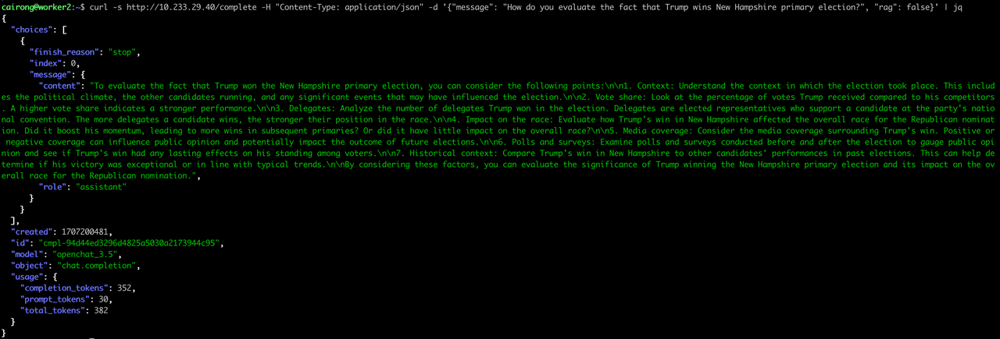
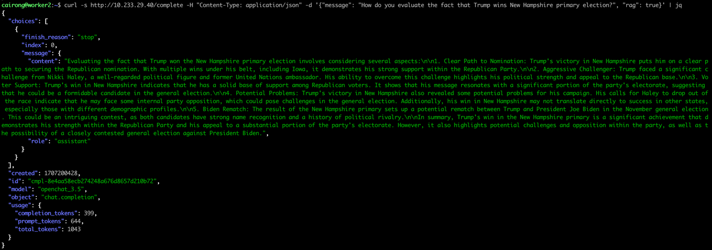

# RAG
基本的 Retrieval Augmented Generation (RAG/检索增强生成) 相关 API 及示例,
有意咨询高级 RAG 系统，请致信 help@sxwl.ai；算想未来团队成员会与您取得联系。

`example`:
```bash
curl -s http://rag.llm.sxwl.ai:30005/complete -H "Content-Type: application/json" -d '{"message": "如何评价特朗普赢得新罕布什尔州初选？", "rag": true}' | jq
```

# 构建RAG
构建一个与大模型结合的Retrieval-Augmented Generation (RAG)系统，可以显著提升模型利用互联网信息进行推理的能力。

RAG通过从大规模文档集合（如互联网）检索相关信息，并将这些信息整合入生成过程中，从而增强模型的回答质量和相关性。

以下是实现这一目标的步骤概述：

## 确定检索源
首先，需要确定检索的数据源，这可以是互联网上的文档、特定领域的数据库或你自己创建的文档集。对于互联网数据，可以考虑使用现成的索引服务，如Elasticsearch，或者专门的数据集，比如Common Crawl。

## 搭建检索系统
接下来，你需要搭建一个检索系统，用于从你选择的数据源中检索信息。如果你选择Elasticsearch，那么需要：
- 部署Elasticsearch集群。
- 索引你的文档数据，确保每个文档都被合理地分词和索引。
- 开发检索接口，以便在收到查询时快速返回相关文档。

## 集成RAG架构
以OpenChat为例：

在模型中集成RAG架构涉及以下几个关键步骤：

- 查询构造：当接收到用户的输入时，构造一个或多个查询来检索相关信息。这可以基于用户输入的直接文本，或者经过某种形式的处理（如关键词提取）来增强检索效率和相关性。
- 信息检索：利用上一步构造的查询，通过检索系统查询相关文档或信息。
- 文档处理：从检索系统返回的文档中提取有用信息，可能需要文档摘要或重要信息抽取，以便将这些信息有效地融入到回答生成过程中。
- 回答生成：将检索到的信息与用户的原始查询一起输入到OpenChat模型中，生成回答。这可能涉及到调整模型的输入格式，以便同时考虑用户的原始问题和检索到的信息。

## 优化和调试
集成后，你需要对系统进行细致的优化和调试，以确保检索到的信息是相关且有用的，且生成的回答质量符合预期。这包括调整检索查询的构造逻辑、优化索引结构以提高检索效率，以及调整生成模型的参数以更好地融合检索信息。

## 实现示例
假设你已经有了一个Elasticsearch检索系统，下面是一段伪代码示例，展示如何将检索到的信息融入OpenChat模型的推理过程中：

```python
from openchat import OpenChat
from elasticsearch import Elasticsearch

def retrieve_documents(query):
    # 连接到Elasticsearch
    es = Elasticsearch('http://localhost:9200')
    # 执行检索
    response = es.search(index="your_index_name", body={"query": {"match": {"content": query}}})
    # 提取相关文档
    documents = [hit["_source"]["content"] for hit in response["hits"]["hits"]]
    return documents

def generate_answer(model, query):
    # 检索相关文档
    documents = retrieve_documents(query)
    # 将检索到的文档与用户查询合并作为模型的输入
    input_text = query + " " + " ".join(documents)
    # 使用OpenChat生成回答
    answer = model.predict(input_text)
    return answer

# 初始化OpenChat模型
model = OpenChat(model="some_openchat_model")
# 用户输入
user_query = "如何构建一个RAG系统？"
# 生成回答
answer = generate_answer(model, user_query)
print(answer)
```

## 注意事项
- 实际应用中可能需要进一步调整和优化，比如对检索结果进行排名、选择最合适的文档进行回答生成等。
- 保证检索系统的实时性和准确性对整个系统的性能至关重要。

通过这种方式，可以显著提升OpenChat模型在对话中利用互联网信息的能力，使其生成的回答更加丰富和精确。

# 加入向量数据库
将向量数据库集成到RAG系统中，以提高检索效率和相关性，涉及以下几个关键步骤：

## 选择向量数据库
首先，你需要选择一个适合你需求的向量数据库；市面上有多种向量数据库可供选择，例如Milvus、Faiss、Elasticsearch的向量搜索功能（通过向量字段），或者Annoy。这些数据库专门为高效存储和检索大规模向量数据而设计。

## 向量化文档
在你的数据源中，每个文档需要被转换成一个向量表示。这通常通过预训练的语言模型完成，比如BERT、GPT或其他专门为特定领域训练的模型。文档向量化的过程如下：
- 对每个文档进行预处理，如分词、去除停用词等。
- 使用预训练模型提取文档的向量表示。通常，这涉及到从模型的最后一层或特定层提取特征向量。
- 将得到的向量存储到向量数据库中。

## 构建检索逻辑
检索逻辑需要被调整，以便通过向量相似度搜索而不是传统的基于关键词的搜索来检索信息。这包括：
- 查询向量化：用户的查询也需要被转换成向量形式，使用与文档相同的模型和方法。
- 执行向量搜索：使用用户查询的向量，在向量数据库中执行最近邻搜索（k-NN），以找到最相似的文档向量。
- 结果处理：根据搜索结果的相似度分数，选取最相关的文档。

## 集成到RAG架构
将向量搜索的结果集成到RAG架构中，以便在回答生成时考虑检索到的信息。与之前的步骤相同，你需要将检索到的文档内容（或其摘要）与用户的原始查询合并，作为模型的输入。

## 实现示例
假设你使用Milvus作为向量数据库，下面是一段伪代码示例，展示如何在检索过程中使用向量数据库：

```python
from openchat import OpenChat
from milvus import Milvus, MetricType
from transformers import BertTokenizer, BertModel
import torch

# 初始化BERT模型和分词器
tokenizer = BertTokenizer.from_pretrained('bert-base-uncased')
model = BertModel.from_pretrained('bert-base-uncased')

# 连接到Milvus数据库
milvus_client = Milvus(host='localhost', port='19530')

def vectorize_text(text):
    # 对文本进行向量化
    inputs = tokenizer(text, return_tensors="pt")
    outputs = model(**inputs)
    # 取最后一层的平均作为文档向量
    vector = outputs.last_hidden_state.mean(dim=1).detach().numpy()
    return vector

def search_documents(query_vector):
    # 在Milvus中执行向量搜索
    search_params = {"metric_type": MetricType.IP, "params": {"nprobe": 10}}
    status, results = milvus_client.search(collection_name="your_collection", query_records=[query_vector], top_k=5, params=search_params)
    # 根据ID检索文档内容（这里假设你有一种方法来根据ID获取文档）
    documents = [retrieve_document_by_id(result.id) for result in results[0]]
    return documents

def generate_answer(model, query):
    # 将查询向量化
    query_vector = vectorize_text(query)
    # 检索相关文档
    documents = search_documents(query_vector)
    # 合并查询和文档作为模型输入
    input_text = query + " " + " ".join(documents)
    # 使用OpenChat生成回答
    answer = model.predict(input_text)
    return answer

# 初始化OpenChat模型
model = OpenChat(model="some_openchat_model")
# 用户输入
user_query = "如何构建一个RAG系统？"
# 生成回答
answer = generate_answer(model, user_query)
print(answer)
```

## 注意事项
- 选择合适的预训练模型和向量维度是关键，这会直接影响到检索的准确性和效率。
- 向量数据库的选择和配置需要根据你的具体需求和资源进行调整。

# 三千平台构建RAG示例
## 部署向量数据库
此处选择开源向量数据库 Milvus

## 构建RAG系统
- 以 openchat 为例，部署推理服务

```yaml
apiVersion: serving.kserve.io/v1beta1
kind: InferenceService
metadata:
  name: openchat
  namespace: cpod
spec:
  predictor:
    containers:
      - name: kserve-container
        command:
          - python3
          - -m
          - ochat.serving.openai_api_server
          - --port
          - "8080"
          - --host
          - "0.0.0.0"
          - --model
          - /mnt/models
        image: dockerhub.kubekey.local/kubesphereio/openchat:v0106
        resources:
          limits:
            cpu: "4"
            memory: 50Gi
            nvidia.com/gpu: "1"
          requests:
            cpu: "1"
            memory: 50Gi
            nvidia.com/gpu: "1"
        volumeMounts:
        - name: pretrained-model
          mountPath: /mnt/models
    volumes:
    - name: pretrained-model
      persistentVolumeClaim:
        claimName: pvc-model-092f8b48e1953c4f
        readOnly: false
```

- 文档向量化并保存到向量数据库

```python
from transformers import AutoTokenizer, AutoModel
from pymilvus import connections, FieldSchema, CollectionSchema, DataType, Collection
import json
import config

# Load model and tokenizer
tokenizer = AutoTokenizer.from_pretrained("sentence-transformers/all-MiniLM-L6-v2")
model = AutoModel.from_pretrained("sentence-transformers/all-MiniLM-L6-v2")

# Your texts
texts = []

# Convert texts to vectors
vectors = []
for text in texts:
    inputs = tokenizer(text, return_tensors="pt", truncation=True, max_length=512)
    outputs = model(**inputs)
    embeddings = outputs.last_hidden_state.mean(dim=1).detach().numpy()
    vectors.append(embeddings[0])

# Connect to Milvus
connections.connect("default", host=config.Config.MILVUS_HOST, port=config.Config.MILVUS_PORT)

# Define fields for the collection
fields = [
    FieldSchema(name="id", dtype=DataType.INT64, is_primary=True, auto_id=True),
    FieldSchema(name="text_vector", dtype=DataType.FLOAT_VECTOR, dim=384)  # Dimension based on the model
]

# Create a collection schema
schema = CollectionSchema(fields, description="Text Collection")

# Create a collection in Milvus
collection_name = config.Config.MILVUS_COLLECTION_NAME
collection = Collection(name=collection_name, schema=schema)

# Insert vectors into the collection
mr = collection.insert([vectors])
ids = mr.primary_keys

# Create a mapping of IDs to texts
id_text_map = {str(id): text for id, text in zip(ids, texts)}

# Save the mapping to a file
map_file = config.Config.ID_TEXT_FILE_NAME
with open(map_file, 'w') as f:
    json.dump(id_text_map, f)

index_params = {"index_type": "IVF_FLAT", "metric_type": "L2", "params": {"nlist": 128}}
collection.create_index(field_name="text_vector", index_params=index_params)
```

- RAG服务示例代码，示例采用直接加载文档方式进行

```python
from flask import Flask, request, jsonify
import requests
from transformers import AutoTokenizer, AutoModel
import json
from pymilvus import connections, Collection

import config

app = Flask(__name__)
app.config.from_object(config.Config)

# Load model and tokenizer for embeddings
tokenizer = AutoTokenizer.from_pretrained("sentence-transformers/all-MiniLM-L6-v2")
model = AutoModel.from_pretrained("sentence-transformers/all-MiniLM-L6-v2")

# Load ID to Text Mapping
with open(config.Config.ID_TEXT_FILE_NAME, 'r') as f:
    id_text_map = json.load(f)

# Connect to Milvus
connections.connect("default", host=app.config['MILVUS_HOST'], port=app.config['MILVUS_PORT'])

collection = Collection(name=app.config['MILVUS_COLLECTION_NAME'])
collection.load()

@app.route("/complete", methods=["POST"])
def complete():
    data = request.json
    message = data.get("message", "")
    rag = data.get("rag", False)  # Get the 'rag' parameter, default to False if not provided

    if rag:
        # Embed the message to create a query vector
        inputs = tokenizer(message, return_tensors="pt", truncation=True, max_length=512)
        outputs = model(**inputs)
        query_vector = outputs.last_hidden_state.mean(dim=1).detach().numpy().flatten().tolist()

        # Search in Milvus for similar embeddings
        search_params = {"metric_type": "L2", "params": {"nprobe": 10}}
        top_k = 3  # Number of similar texts to retrieve
        results = collection.search([query_vector], "text_vector", search_params, top_k)

        # Construct a new prompt from the search results and the original message
        similar_texts = [id_text_map.get(str(hit.id), "Related text not found") for hit in results[0]]
        prompt = f"Based on: {'; '.join(similar_texts)}.\nMy question is: {message}"
    else:
        # If 'rag' is False, use the original message as the prompt
        prompt = message

    # Construct the payload for OpenChat
    openchat_payload = {
        "model": "openchat_3.5",
        "messages": [{"role": "user", "content": prompt}]
    }

    # Invoke the OpenChat API with the constructed payload
    response = requests.post(app.config['OPENCHAT_URL'], json=openchat_payload)

    if response.status_code == 200:
        resp_data = response.json()
        return jsonify(resp_data)  # Return the OpenChat response
    else:
        return jsonify({"error": "Failed to get response from OpenChat", "status_code": response.status_code})

if __name__ == "__main__":
    app.run(debug=True, host='0.0.0.0', port=5000)
```

- 将代码及运行环境打成镜像

```dockerfile
# Use an official Python runtime as a parent image
FROM dockerhub.kubekey.local/kubesphereio/torch-base:2024-01-12

# Set the working directory in the container
WORKDIR /app

# Copy the current directory contents into the container at /app
COPY service.py /app/service.py
COPY config.py /app/config.py
COPY id_text_map.json /app/id_text_map.json
COPY requirements.txt /app/requirements.txt

# Install any needed packages specified in requirements.txt
RUN pip install --no-cache-dir -r requirements.txt -i https://pypi.tuna.tsinghua.edu.cn/simple

# Make port 5000 available to the world outside this container
EXPOSE 5000

# Run service.py when the container launches
CMD ["python", "service.py"]
```

- 拉起服务 pod

```yaml
---
apiVersion: v1
kind: Service
metadata:
  name: rag-service
spec:
  selector:
    app: rag-service
  ports:
    - protocol: TCP
      port: 80
      targetPort: 5000
      nodePort: 32000
  type: NodePort
---
apiVersion: apps/v1
kind: Deployment
metadata:
  name: rag-service-deployment
spec:
  replicas: 1
  selector:
    matchLabels:
      app: rag-service
  template:
    metadata:
      labels:
        app: rag-service
    spec:
      containers:
        - name: rag-service
          image: dockerhub.kubekey.local/kubesphereio/rag-service:v0.0.6
          ports:
            - containerPort: 5000
          env:
            - name: MILVUS_HOST
              value: "10.233.52.22"
            - name: MILVUS_PORT
              value: "19530"
            - name: OPENCHAT_URL
              value: "http://10.233.57.192/v1/chat/completions"
```

## 使用示例
- 准备示例文档

```text
https://apnews.com/article/trump-new-hampshire-primary-two-candidate-race-72a59c4133879eaeec63d6ed30e91e01

MANCHESTER, N.H. (AP) — Former President Donald Trump easily won New Hampshire’s primary on Tuesday, seizing command of the race for the Republican nomination and making a November rematch against President Joe Biden feel all the more inevitable.
The result was a setback for former U.N. Ambassador Nikki Haley, who finished second despite investing significant time and financial resources in a state famous for its independent streak. She’s the last major challenger after Florida Gov. Ron DeSantis ended his presidential bid over the weekend, allowing her to campaign as the sole alternative to Trump.
Trump’s allies ramped up pressure on Haley to leave the race before the polls had closed, but Haley vowed after the results were announced to continue her campaign. Speaking to supporters, she intensified her criticism of the former president, questioning his mental acuity and pitching herself as a unifying candidate who would usher in generational change.

https://www.reuters.com/world/us/trump-seeks-big-victory-haley-tries-stop-him-new-hampshire-votes-2024-01-23/

MANCHESTER, New Hampshire, Jan 23 (Reuters) - Donald Trump cruised to victory in New Hampshire's Republican presidential contest on Tuesday, marching closer to a November rematch with Democratic President Joe Biden even as his only remaining rival, former U.N. Ambassador Nikki Haley, vowed to soldier on.
"This race is far from over," she told supporters at a post-election party in Concord, challenging Trump to debate her. "I'm a fighter. And I'm scrappy. And now we're the last one standing next to Donald Trump."

https://www.npr.org/2024/01/23/1225662487/donald-trump-wins-nh-primary-results

MANCHESTER, N.H. — Former President Donald Trump has won the New Hampshire primary, according to The Associated Press, a victory that puts him on a clear path to securing the Republican nomination.
Trump dominated in last week's Iowa caucuses and has now won the first-in-the-nation primary as well.
In New Hampshire, he withstood an aggressive challenge from his former United Nations ambassador, Nikki Haley, who is the final major Republican candidate standing in Trump's way after other hopefuls dropped out.

https://www.wsj.com/livecoverage/new-hampshire-gop-primary-election-2024

Donald Trump won New Hampshire's Republican presidential primary on Tuesday, besting his only top-tier rival in the GOP race, Nikki Haley. It comes on the heels of Trump's record-breaking victory in Iowa last week. The former president kept up his calls for Haley to drop out of the race on Tuesday night, but Haley told supporters, “This race is far from over” and vowed to press ahead.
Donald Trump: He appears to be on his way to the GOP nomination, but Tuesday's contest signaled some problems for Trump as a candidate in November's general election.
Nikki Haley: With her path to victory narrowing, the former South Carolina governor maintained that she is the anti-chaos candidate who can beat President Biden in the November election.
Democrats: Biden, who wasn't on Tuesday's primary ballot but still won thanks to a write-in campaign, is now gearing up for a rematch with Trump this fall.
The next big contest: South Carolina's GOP presidential primary on Feb. 24 gets the spotlight next on the election calendar with early state polling showing Trump leading Haley, despite her close ties to the state.
```

- 向量化文档并存入向量数据库

```shell
python save_to_milvus.py trump_news.txt
```

- 不开启RAG，调用模型推理

```shell
curl -s http://10.233.29.40/complete -H "Content-Type: application/json" -d '{"message": "How do you evaluate the fact that Trump wins New Hampshire primary election?", "rag": false}' | jq
```


- 开启RAG，调用模型推理
```shell
curl -s http://10.233.29.40/complete -H "Content-Type: application/json" -d '{"message": "How do you evaluate the fact that Trump wins New Hampshire primary election?", "rag": true}' | jq
```


可以看到，在开启RAG后，openchat 在推理时给出了更丰富的回答。